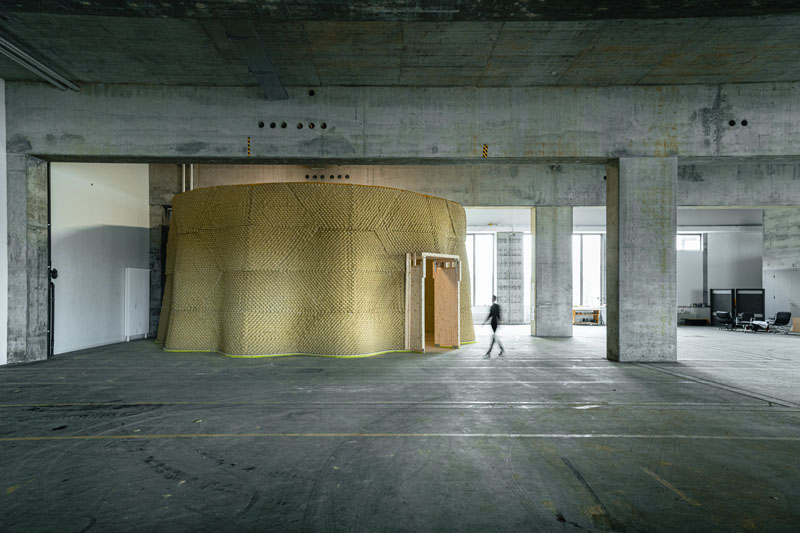
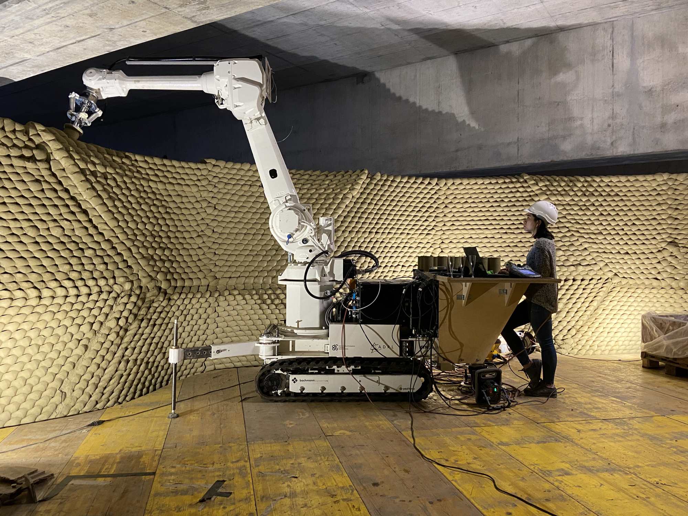
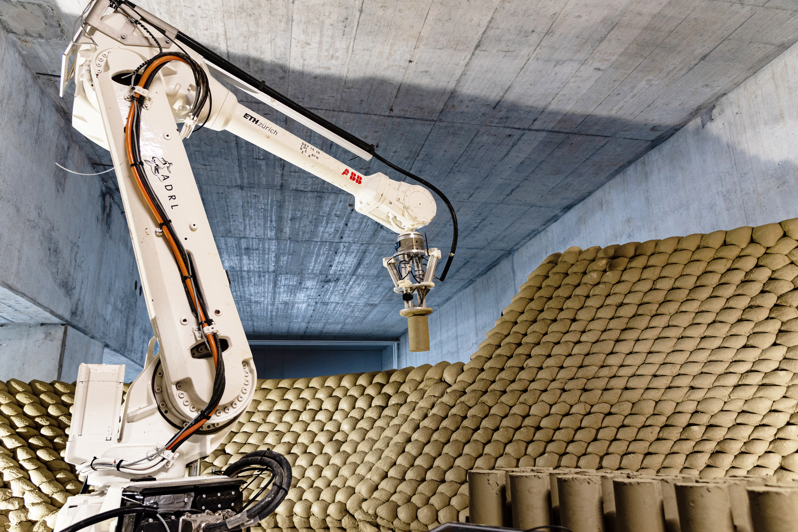
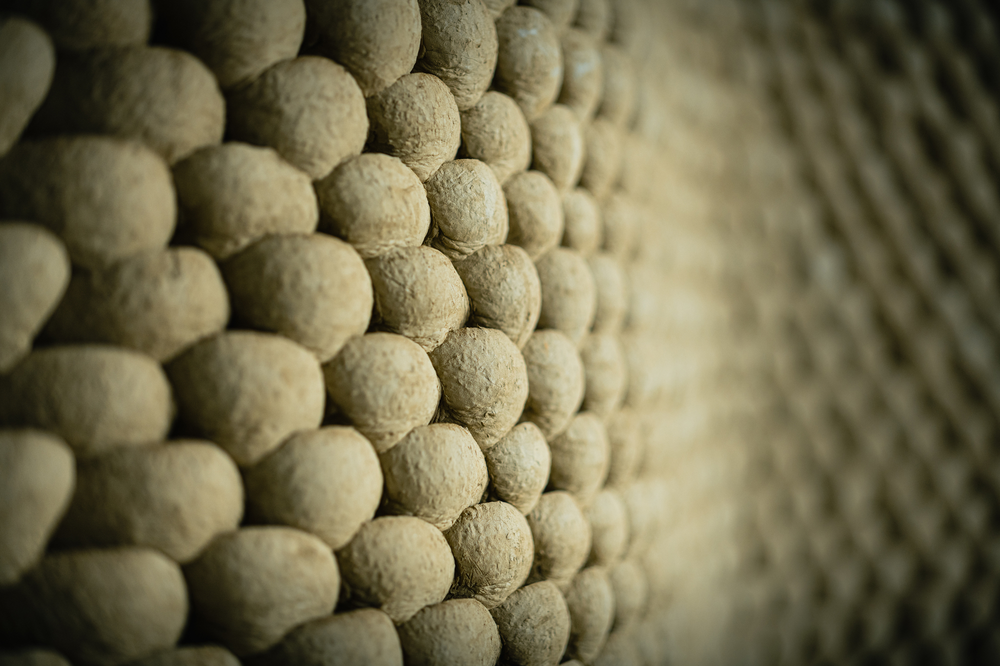
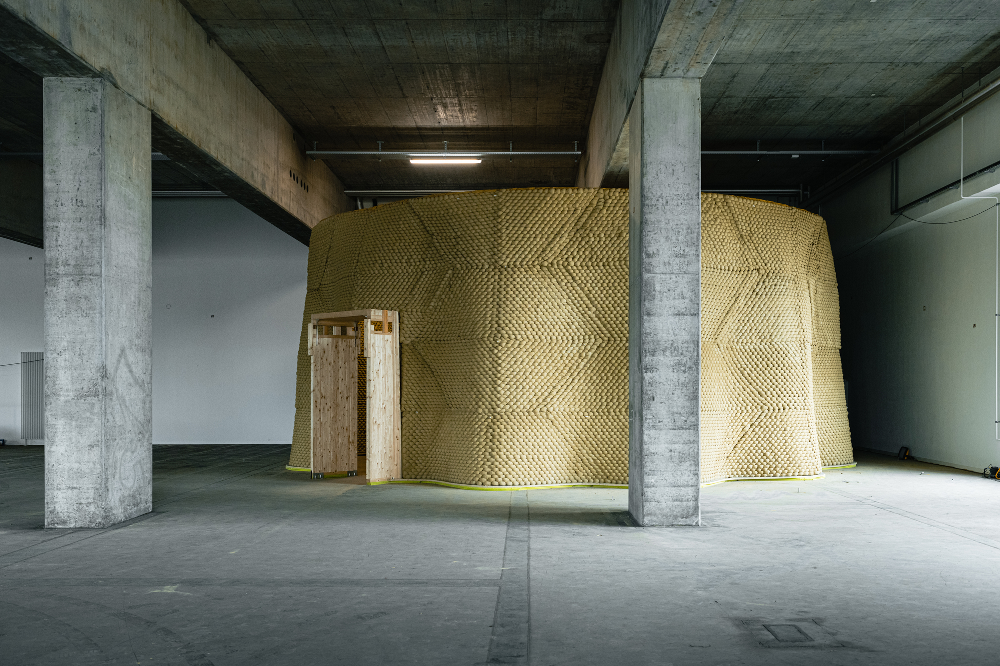

A circular undulating clay wall 5 m high with a 6 m radius built using a
method of robotic clay aggregation developed at MAS DFAB and in my thesis
project Adaptive Clay Formations.

<!-- more -->
The Clay Rotunda is a cylindrical structure made of clay that serves as the
outer shell of the SE MusicLab. Located inside the Gurtenbrauerei in Bern, this
high-fidelity music auditorium combines sustainable building materials with
computational design techniques.

With a diameter of nearly 11 meters and a height of 5 meters, the structure
features a thin wall width of only 15 cm, showcasing the strength and
versatility of unreinforced clay.

Using a mobile robotic system, over 30,000 soft clay bricks were aggregated
on-site over a span of 50 days to construct the Clay Rotunda.

|                  |                                                                                                         |
| ---------------- | ------------------------------------------------------------------------------------------------------- |
| Years            | 2020-2021                                                                                               |
| Location         | Gurtenbrauerei, Bern, Switzerland                                                                       |
| Context          | Construction project realized by [Gramazio Kohler Research, ETH Zürich](https://gramaziokohler.arch.ethz.ch/)                                   |
| Role             | research & development, programming lead, on site construction                                          |
| Team             | David Jenny, Coralie Ming, Edurne Morales Zúñiga, Jomana Baddad, Indra Santosa, & Anton Tetov Johansson |
| Project partners | Gotham Design, Lehmag, Seforb & Brauchli Ziegelei                                                       |

See [project on Gramazio Kohler's website](https://gramaziokohler.arch.ethz.ch/web/e/projekte/430.html)
for more information and video.

Edurne Morales Zúñiga & In-Situ Fabricator

In-Situ Fabricator

Photos are © Gramazio Kohler 2020-2021
