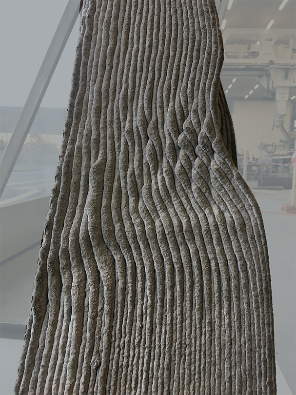
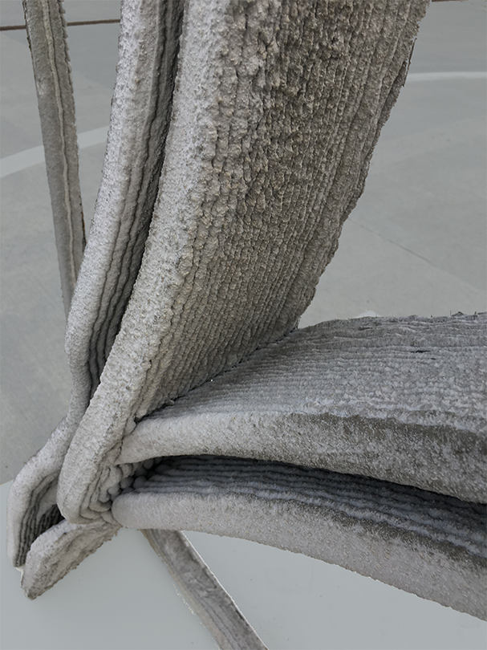

Design and research project into robotic concrete 3D-printing of facade
elements, built on Ana Anton's (DBT) research into robotic concrete 3D-printing.

<!-- excerptEnd -->

|              |                                                                                      |
| ------------ | ------------------------------------------------------------------------------------ |
| Year         | 2019                                                                                 |
| Context      | MAS DFAB, ETH, Zürich, Switzerland                                                   |
| Collaborator | László Mangliár                                                                      |
| Tutors       | Ana Anton, Eleni Skevaki & Yoana Taseva at Digital Building Technologies, ETH Zürich |

`video: title: "Concrete Calligraphy: Growth() - Fabrication": ./print-video.webm`

