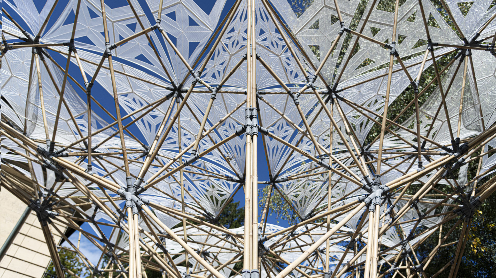
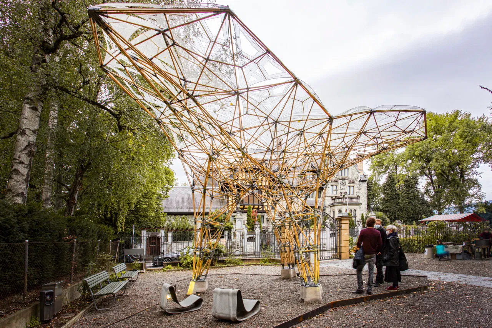

Description 40 m² pavilion made out of straight bamboo members and bespoke
3D-printed nylon joints. Designed and built by the whole class of
MAS DFAB 19/20, project led by Marirena Kladeftira at Digital Building
Technologies, ETH Zürich.

<!-- excerptEnd -->

|          |                                                                                                                                                                                                                                                                                                                |
| -------- | -------------------------------------------------------------------------------------------------------------------------------------------------------------------------------------------------------------------------------------------------------------------------------------------------------------- |
| Year     | 2020                                                                                                                                                                                                                                                                                                           |
| Location | Zentrum Architektur Zürich, Switzerland                                                                                                                                                                                                                                                                        |
| Role     | Student, part of design and structural analysis team                                                                                                                                                                                                                                                           |
| Tutors   | Marirena Kladeftira, Matthias Leschok, Eleni Skevaki & Yael Ifrah at Digital Building Technologies, ETH Zürich, and Davide Tanadini, Ole Ohlbrock & Pierluigi D’Acunt at the chair of Structural Design, ETH Zürich                                                                                            |
| Team     | Maria Pia Assaf, Jomana Baddad, Frederic Brisson, Yu-Hung Chiu, Rémy Clemente, Ioulios Georgiou, Mahiro Goto, Anton Johansson, Laszlo Mangliar, Dinorah Martinez Schulte, Edurne Morales Zuniga, Fatemeh Salehi Amiri, Emmanuelle Sallin, Indra Santosa, Eliott Sounigo, Chanon Techathuvanun & Ping-Hsun Tsai |

See [project on DBT's website](https://dbt.arch.ethz.ch/project/digital-bamboo/)
for more information and videos.
