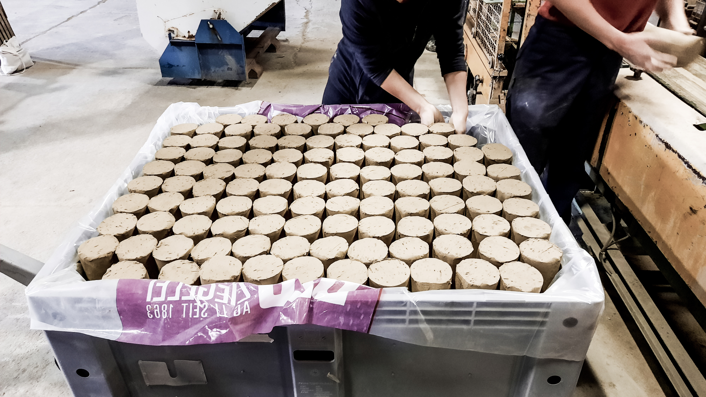
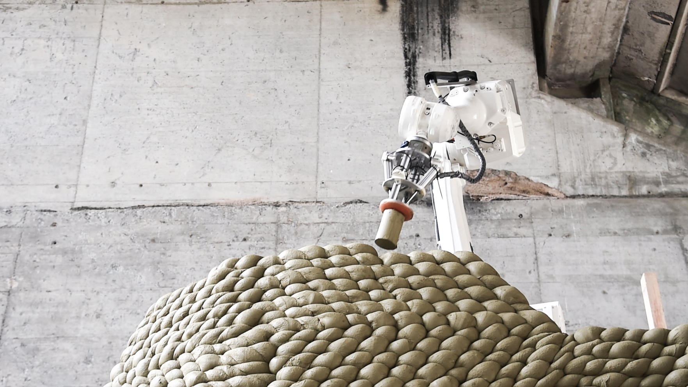
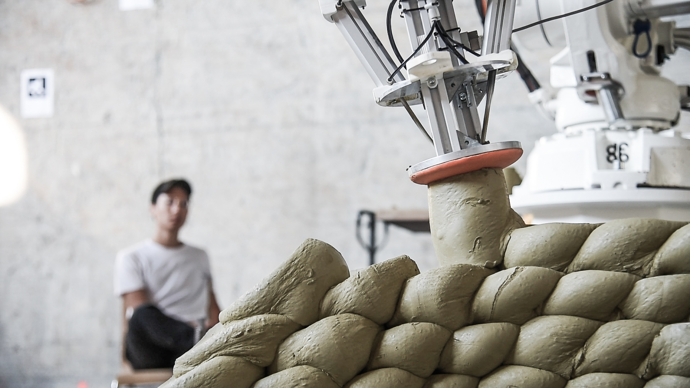

Gramazio Kohler Research's MAS DFAB pavilion project 2019/2020.

Quarter of circular undulating clay wall 5 m high with a 6 m radius built using
a method of robotic clay aggregation developed at MAS DFAB. Built to test
construction height and openings. The structure was built by a small team in
3 weeks.

<!-- excerptEnd -->

|                   |                                                                                                                                   |
| ----------------- | --------------------------------------------------------------------------------------------------------------------------------- |
| Year              | 2020                                                                                                                              |
| Location          | Lehmag, Brunnen, Switzerland                                                                                                      |
| Role              | Student, robot control lead                                                                                                       |
| Team              | David Jenny, Coralie Ming, Edurne Morales Zúñiga, Jomana Baddad, Indra Santosa, Tsai Ping, Eliott Sounigo & Anton Tetov Johansson |
| Industry partners | Lehmag AG & Brauchli Ziegelei AG                                                                                                  |

